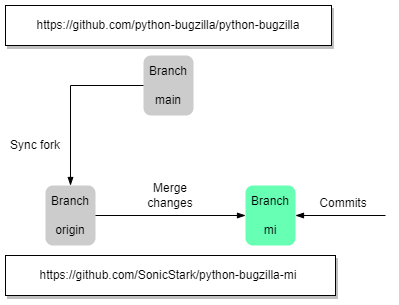

# python-bugzilla-mi

As you can see, this project is a fork of [python-bugzilla/python-bugzilla](https://github.com/python-bugzilla/python-bugzilla). A ***Machine Interface*** (i.e. ***MI***) is used as wrapper (or for replacing in some sense) on all the original features. And the concept of ***MI*** originates from the well-known [GDB: The GNU Project Debugger](https://www.sourceware.org/gdb/) with docs at [GDB User Manual - The GDB/MI Interface](https://sourceware.org/gdb/current/onlinedocs/gdb/GDB_002fMI.html#GDB_002fMI).

The purpose of introducing **MI** in *python-bugzilla-mi* is also to support using it as just one small component of a larger system.

## Workflow

*python-bugzilla-mi* is very different from *python-bugzilla* because **MI** replaces most of original **CLI** features. So it will be treated as an independent branch and the latest features in *python-bugzilla* will be merged into this branch in time. 

:warning:The original project has been greatly simplified due to limited time and resources of the developers. If you are not a member of our organization, please be careful before running the scripts and make sure that you know its difference from [python-bugzilla/python-bugzilla](https://github.com/python-bugzilla/python-bugzilla) and understand the possible consequences (for example your Bugzilla account may be judged as suspicious by the administrator and then be disabled).

## Documentation 

`bugzilla-mi` is the entrance of *python-bugzilla-mi* in which you can talking to a [Bugzilla](https://www.bugzilla.org/) instance over XMLRPC or REST. Also original  features about performing actions from the command line is still available but with a different usage, such as create or edit bugs, various queries, etc.

`bugzilla-cli` still provides exactly the same features as before (also same as the original CLI tool `/usr/bin/bugzilla`).

Please browse things in `docs` for more details.
